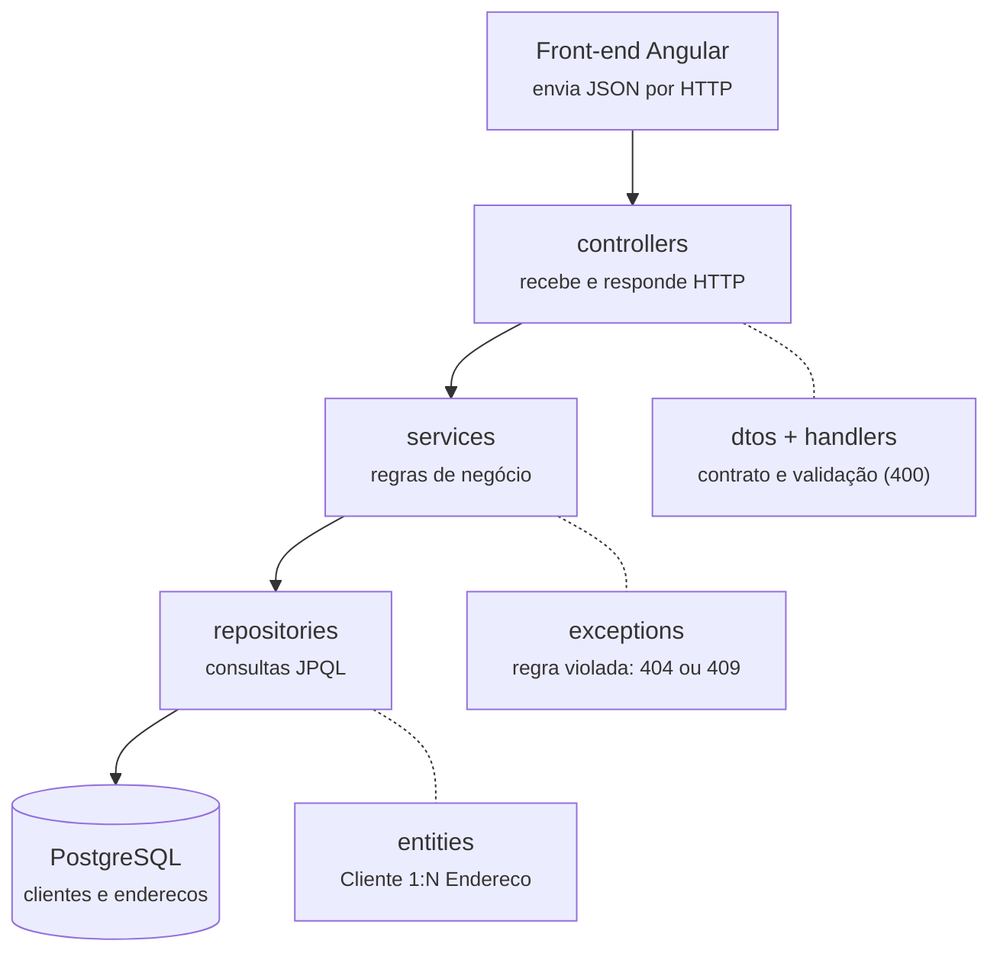
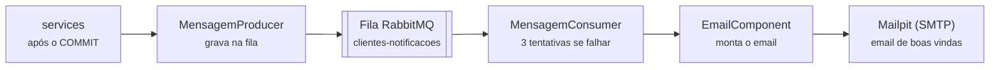

# clientesApi

API REST em **Spring Boot** para gerenciamento de clientes e seus endereços — Projeto Final da formação Java WebDeveloper.

## Tecnologias

Spring Boot 4 (Java 25) · Spring Web · Spring Data JPA · Bean Validation · Swagger/OpenAPI (springdoc) · PostgreSQL · RabbitMQ · Spring Mail · Docker Compose · Lombok · DevTools · JUnit 5 + Java Faker

## Executando

```bash
docker compose up -d      # PostgreSQL, pgAdmin, RabbitMQ e Mailpit
./mvnw spring-boot:run    # API em http://localhost:8083
```

> Com a dependência *Docker Compose Support*, o `spring-boot:run` também sobe os containers automaticamente.

| Serviço | Endereço |
|---|---|
| Swagger UI | http://localhost:8083/swagger-ui/index.html |
| api-docs (importar no POSTMAN) | http://localhost:8083/v3/api-docs (cópia em `docs/api-docs.json`) |
| RabbitMQ (painel) | http://localhost:15672 — usuário `coti` / senha `coti` |
| Mailpit (emails enviados) | http://localhost:8025 |
| pgAdmin | http://localhost:5053 — `coti@email.com` / `Coti@2026` |
| PostgreSQL | `localhost:5436`, banco `bd-clientesapi`, usuário `coti` / senha `coti` |

## Endpoints

| Método | Rota | Descrição |
|---|---|---|
| POST | `/api/clientes` | Cadastra um cliente com um endereço (envia email de boas vindas) |
| PUT | `/api/clientes` | Edita o cliente e um endereço (`endereco.id` nulo adiciona um novo endereço) |
| DELETE | `/api/clientes/{id}` | Exclui o cliente e os seus endereços |
| GET | `/api/clientes` | Consulta todos os clientes com endereços, em ordem alfabética (JPQL) |
| GET | `/api/clientes/{id}` | Consulta 1 cliente com endereços (JPQL) |

Respostas: `201`/`200` com o cliente, `400` com os erros de validação por campo, `404` cliente/endereço não encontrado, `409` CPF já cadastrado, `500` erro inesperado (mensagem amigável; o detalhe técnico fica no log).

### Regras de validação

- **nome**: obrigatório, de 8 a 100 caracteres
- **email**: obrigatório, formato válido
- **cpf**: obrigatório, exatamente 11 dígitos numéricos (REGEX) e único
- **dataNascimento**: obrigatória (`yyyy-MM-dd`) e anterior à data atual
- **endereço**: logradouro, número, bairro, cidade, UF (2 letras, gravada em maiúsculas) e CEP (8 dígitos) obrigatórios; complemento opcional

### Relacionamento

`Cliente 1:N Endereco`: um cliente pode ter vários endereços e cada endereço pertence a um único cliente (chave estrangeira `cliente_id` na tabela `enderecos`).

- Todo cliente é cadastrado com um endereço; outros endereços são adicionados na edição (`endereco.id` nulo).
- A edição altera um endereço por vez, e só um endereço que pertença ao próprio cliente.
- Ao excluir o cliente, os seus endereços são excluídos junto (`cascade = ALL`, `orphanRemoval = true`).
- O CPF é único: conferido pelo `ClienteService` e garantido pela restrição `UNIQUE` do banco (inclusive em cadastros simultâneos, que retornam `409`).

## Mensageria (envio de email)

Ao cadastrar um cliente, o `ClienteService` usa o **PRODUCER** (`components/MensagemProducer`) para gravar a mensagem na fila `clientes-notificacoes` do RabbitMQ. O **CONSUMER** (`components/MensagemConsumer`) lê a fila e envia o email pelo `EmailComponent` (SMTP do Mailpit em desenvolvimento).

- A mensagem só é gravada na fila **depois do COMMIT** do cadastro, para não dar boas vindas a um cadastro desfeito.
- Se o RabbitMQ estiver fora do ar, o cadastro é concluído mesmo assim (a falha é registrada no log).
- Se o envio do email falhar, o CONSUMER tenta 3 vezes (intervalos de 2s e 4s) e depois descarta a mensagem, em vez de reprocessá-la sem parar.

## Estrutura em camadas

```
configurations  Swagger, CORS (qualquer origem) e RabbitMQ
controllers     ENDPOINTS REST
dtos            Contratos de dados (records) com Bean Validation
entities        Cliente 1:N Endereco (JPA)
repositories    Consultas JPQL
services        Regras de negócio
components      Producer, Consumer e envio de email
exceptions      Exceções de negócio
handlers        Tratamento global dos erros de validação
```

### Fluxo de uma requisição



### Por que cada pacote existe

| Pacote | O que faz | Por que é separado |
|---|---|---|
| `controllers` | Recebe as chamadas HTTP e devolve o código certo (201, 200, 404, 409 ou 500). | É a "recepção" da API: não decide nada sobre clientes, só atende e encaminha. Mudar rota ou formato de resposta não toca nas regras de negócio. |
| `dtos` | Records que definem o que entra (`CriarClienteRequest`, `EditarClienteRequest`) e o que sai (`ClienteResponse`), com as validações nas anotações. | É o contrato com quem usa a API. As entidades nunca são expostas, o que evita laço infinito no JSON (cliente → endereço → cliente...) e permite mudar o banco sem quebrar o front-end. |
| `handlers` | O `ValidationExceptionHandler` transforma erros de validação em uma resposta 400 com a mensagem de cada campo. | Sem ele, cada endpoint montaria a própria resposta de erro. Centralizado, o formato é igual em toda a API. |
| `services` | O `ClienteService` aplica as regras de negócio e controla as transações (`@Transactional`). | É o "cérebro" do sistema: as regras moram num lugar só. O controller e o banco podem mudar e as regras continuam as mesmas. |
| `exceptions` | `CpfJaCadastradoException` e `RegistroNaoEncontradoException`. | Dão nome aos problemas de negócio. O service diz o que aconteceu ("CPF já existe") e o controller decide como responder (409). |
| `repositories` | O `ClienteRepository` faz as consultas JPQL, com `JOIN FETCH` para trazer clientes e endereços numa só ida ao banco. | Isola o acesso ao banco: o service pede "clientes em ordem alfabética" sem saber como a consulta é escrita. |
| `entities` | `Cliente` e `Endereco`, mapeados para as tabelas com JPA (1:N). | Representam os dados como existem no banco, e o relacionamento reflete a realidade: uma pessoa pode ter vários endereços; cada endereço é de uma pessoa só. |
| `components` | `MensagemProducer`, `MensagemConsumer` e `EmailComponent`. | Infraestrutura que o service usa, mas que não é regra de negócio. O servidor de email pode mudar sem afetar o cadastro. |
| `configurations` | Swagger (documentação), CORS (permite o front-end chamar a API) e RabbitMQ (fila em JSON). | Configurações técnicas num lugar previsível, separadas do código de negócio. |

### Fluxo do email de boas vindas



A fila funciona como deixar uma carta na caixa do correio em vez de esperar o carteiro na porta: o cadastro termina na hora, o cliente não espera o servidor de email responder, e uma falha no email não desfaz o cadastro.

### Fora do código Java

| Item | Por que existe |
|---|---|
| `application.yaml` | Conexões com banco, fila e email e a porta 8083 num lugar só: trocar de ambiente é mudar este arquivo, não o código. |
| `docker-compose.yml` | Sobe PostgreSQL, pgAdmin, RabbitMQ e Mailpit com um comando, sem instalar nada disso na máquina. |
| `backup-bd-clientesapi.sql` | Restaura a estrutura do banco e os clientes de exemplo. |
| `docs/api-docs.json` | Cópia da documentação da API para importar no Postman. |
| `src/test` | Testes de integração de cada endpoint (sucesso e erro) e do fluxo completo de email, conferido no Mailpit. |

## Testes

Testes de integração com JUnit 5, MockMvc e Java Faker para cada endpoint e para o fluxo de mensageria (o email é verificado pela API do Mailpit). Requer os containers em execução:

```bash
docker compose up -d
./mvnw test
```

## Backup do banco de dados

`src/main/resources/backup-bd-clientesapi.sql` contém a estrutura e os dados de exemplo do banco. Para restaurar (substitui as tabelas `clientes` e `enderecos`):

```bash
docker exec -i clientesapi-postgres psql -U coti -d bd-clientesapi -f - < src/main/resources/backup-bd-clientesapi.sql
```
